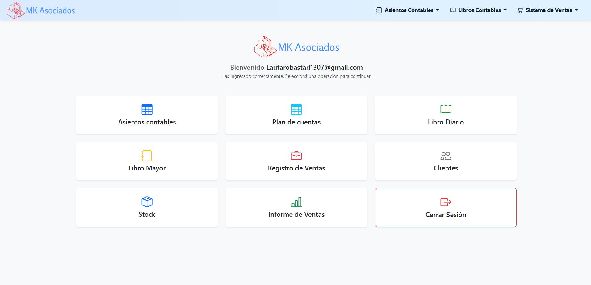
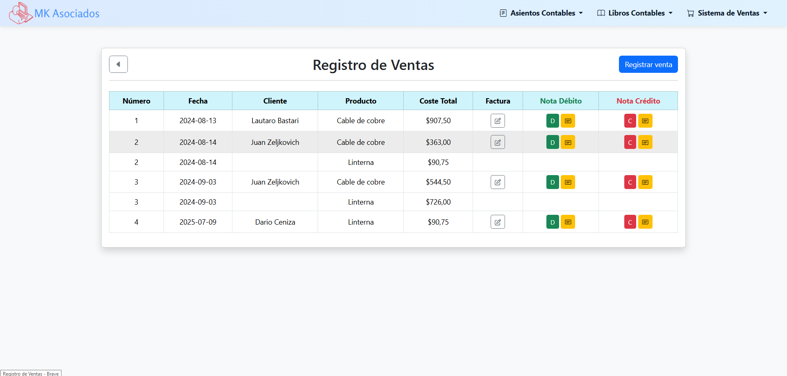
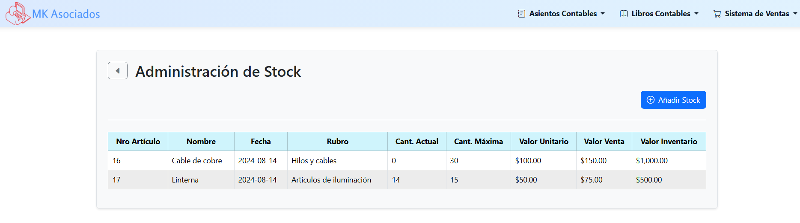

# Sistema Contable Web – Portfolio

Sistema contable y de gestión desarrollado como **proyecto de portfolio**, con el objetivo de demostrar **lógica de negocio real**, **integridad contable** y **buenas prácticas** en aplicaciones web desarrolladas con **PHP y MySQL**, sin frameworks externos.

El sistema implementa el **circuito completo de un comercio**, integrando **operación comercial y contabilidad**, con generación automática de **asientos contables**, **Libro Diario** y **Libro Mayor**, manteniendo consistencia y trazabilidad de la información.

---

## Alcance del Sistema

El sistema permite:

- Gestionar ventas, compras y stock
- Automatizar la generación de asientos contables
- Mantener libros contables consistentes
- Controlar accesos mediante roles de usuario
- Reducir errores manuales mediante validaciones y reglas de negocio

Está orientado a **pequeños y medianos comercios**, priorizando control interno, claridad operativa y correcta registración contable.

---

## Capturas del Sistema

### Panel Principal
Vista general del sistema con acceso a los módulos operativos y contables.

---

### Registro de Ventas
Gestión de ventas con impacto directo en stock y contabilidad, incluyendo generación de comprobantes.

---

### Libro Diario
Registro cronológico de los asientos contables, respetando el esquema **Debe / Haber**.

---

### Libro Mayor
Consulta de movimientos y saldos por cuenta contable, con acumulados.

---

### Administración de Stock
Control de inventario integrado al circuito de ventas y compras.

---

## Funcionalidades Principales

### Operación Comercial

- **Ventas**
  - Registro detallado de productos
  - Cálculo automático de totales
  - Impacto inmediato en stock
- **Compras**
  - Registro de compras
  - Actualización automática de inventario
- **Stock**
  - Gestión de productos
  - Control de existencias y movimientos
- **Facturación**
  - Emisión y registro de comprobantes

---

### Contabilidad

- **Asientos contables automáticos**
  - Cada venta o compra genera su asiento correspondiente
  - Validación estricta de balance (**Debe = Haber**)
- **Libro Diario**
  - Visualización cronológica de asientos
  - Filtros por período
- **Libro Mayor**
  - Movimientos y saldos por cuenta contable
- **Plan de cuentas**
  - Configurable según el negocio

---

### Seguridad y Control

- Sistema de autenticación
- **Roles de usuario** (administrador / operador)
- Restricción de acciones según rol
- Validaciones de datos
- Trazabilidad de operaciones (usuario y fecha)

---

## Tecnologías Utilizadas

- **PHP** – lógica de negocio y backend
- **MySQL** – persistencia de datos
- **phpMyAdmin** – administración de base de datos
- **Bootstrap** – interfaz responsive
- **XAMPP** – entorno de desarrollo local

---

## Enfoque Técnico

El proyecto está desarrollado en **PHP procedural**, organizado por responsabilidades, sin el uso de frameworks externos.

Se prioriza:

- Modelado correcto de datos
- Separación lógica entre operación, contabilidad y presentación
- Reglas contables consistentes
- Automatización de procesos críticos
- Código claro, legible y mantenible

El objetivo es demostrar dominio de **PHP puro**, **SQL** y **lógica de negocio**, evitando abstracciones innecesarias.

---

## Estructura del Proyecto

La estructura del repositorio refleja una organización simple y clara, acorde a un entorno PHP sin framework:

assets/ -> recursos estáticos (imágenes, estilos, íconos)
controlador/ -> lógica de negocio y acciones (altas, bajas, modificaciones)
partials/ -> componentes reutilizables (navbar, header, etc.)
docs/ -> documentación y capturas del sistema

conexionPDC.php / database.php
-> conexión a la base de datos

home.php, index.php, login.php
-> pantallas principales y navegación

asientos.php, libroDiario.php, libroMayor.php
-> módulos contables

ventas.php, informeVentas.php
-> operación comercial

clientes.php, stock.php
-> gestión de maestros

La estructura prioriza **claridad**, **trazabilidad del flujo** y **mantenibilidad**, manteniendo el proyecto simple y entendible.

---

## Flujo Contable

### Venta
1. Se registra la venta
2. Se descuenta stock
3. Se genera el asiento contable
4. Se registra en el Libro Diario
5. Se refleja en el Libro Mayor

### Compra
1. Se registra la compra
2. Se incrementa stock
3. Se genera el asiento contable
4. Se actualizan los libros contables

---

## Objetivo del Proyecto

Demostrar la capacidad de diseñar e implementar un **sistema de gestión real**, integrando:

- Operación comercial
- Contabilidad básica correcta
- Persistencia de datos
- Validaciones y control interno

---

## Estado del Proyecto

Proyecto **funcional**, con mejoras en curso orientadas a:

- Reportes contables avanzados
- Exportación de información
- Auditoría y control
